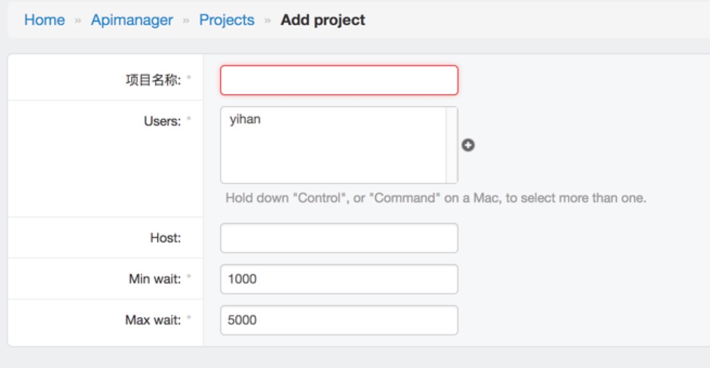

# ApiTest

## 特性
1. 利用requests发送http请求
2. 支持自定义python function，用于token计算，加密等操作 apitest/func.py:g
3. 数据设定支持jinja2模板 (自定义function--f.xx  引用已填写数据 v.xx )
    - 录入当前时间
        - {{ f.unix_time() }}
    - 计算token 
        - {{ f.token(v.source_system_code, v.token2, v.timestamp) }}
    - 根据row_cnt生成json串 
        - [   {"name":"test"} ,    ]
    - 下划线开头的参数不会被传送，仅用于计算
4. 支持结果检验
5. 支持locust压测
6. 提供http接口一键测试相应testcase  /api/run
7. 用例复制

## 截图

### 测试用例管理

### 用例结果展示

### 项目管理

 